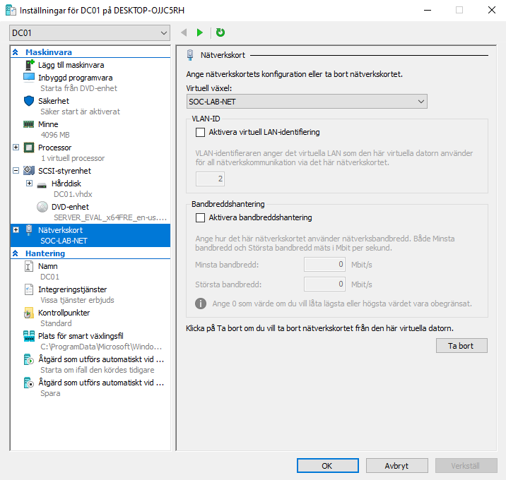

# Infrastructure Deployment – SOC Lab

## Objective

Deploy the core infrastructure required to simulate enterprise authentication and security monitoring scenarios.

DC01 will function as:

- Active Directory Domain Controller
- DNS Server
- Central authentication authority
- Primary log source for brute force detection

## Virtual Machine Configuration – DC01

Name: DC01  
Generation: 2  
Startup Memory: 4096 MB (Dynamic Memory Disabled)  
Virtual Disk: 60 GB  
Network: SOC-LAB-NET  

## Evidence

### DC01 Virtual Machine Created

### DC01 Connected to SOC-LAB-NET

## Security Rationale

The domain controller represents a high-value asset in enterprise environments.

All authentication attempts, successful or failed, will be logged here and later analyzed for detection engineering purposes.

