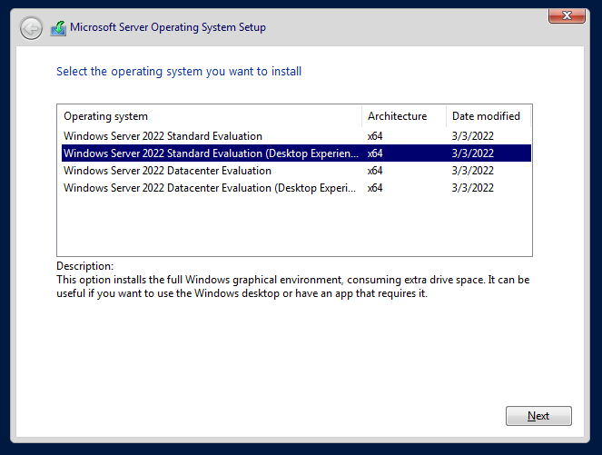
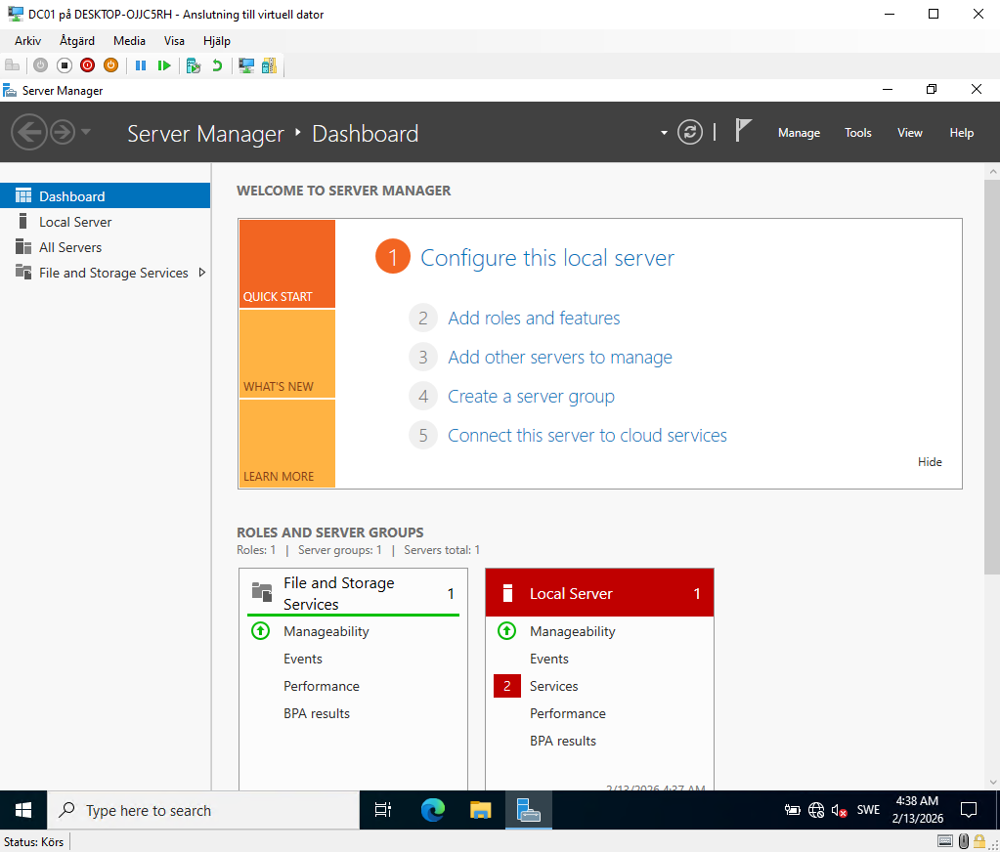
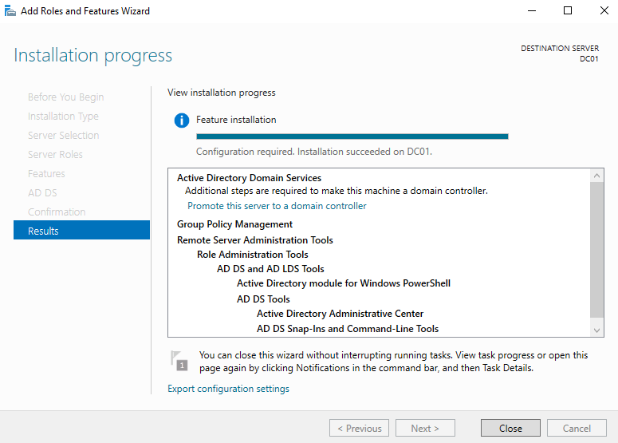
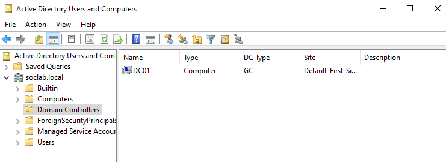

# Infrastructure Deployment

## Objective

Deploy the core infrastructure required to simulate enterprise authentication and security monitoring scenarios.

DC01 will function as:

- Active Directory Domain Controller
- DNS Server
- Central authentication authority
- Primary log source for brute force detection

## Virtual Machine Configuration - DC01

Name: DC01  
Generation: 2  
Startup Memory: 4096 MB (Dynamic Memory Disabled)  
Virtual Disk: 60 GB  
Network: SOC-LAB-NET  

## Evidence

### DC01 Virtual Machine Created

### DC01 Connected to SOC-LAB-NET

## Security Rationale

The domain controller represents a high-value asset in enterprise environments.

All authentication attempts, successful or failed, will be logged here and later analyzed for detection engineering purposes.

## Operating System Installation - DC01

Operating System:
Windows Server 2022 Standard Evaluation (Desktop Experience)

The Desktop Experience version was selected to simplify configuration, event log inspection, and documentation.

Administrator credentials were configured during installation.

The system is now ready for network configuration and hostname standardization before Active Directory deployment.

## Evidence

### OS Version Selection

### Initial Server Login

## Network Configuration and Hostname Standardization

The server was configured with a static IPv4 address prior to Active Directory deployment.

Network configuration:

- IP address: 192.168.100.10
- Subnet mask: 255.255.255.0
- Default gateway: none
- Preferred DNS server: 192.168.100.10

DNS was configured to point to itself in preparation for Active Directory Domain Services installation.

The hostname was standardized to:

DC01

The server was rebooted to apply changes.

## Evidence

### Static IPv4 Configuration

### Hostname Configuration

### IP Verification After Reboot

## Active Directory Deployment

The Active Directory Domain Services role was installed on dc01.

The server was promoted to Domain Controller by creating a new forest.

Domain name:

soclab.local

Forest functional level:

Windows Server 2016 (default configuration)

The server automatically rebooted after promotion.

DC01 now functions as:

- Domain Controller
- DNS Server
- Central authentication authority

## Evidence

### AD DS Role Installation

### Domain Successfully Created

### DNS Forward Lookup Zone

## Domain User Preparation for Attack Simulation

An organizational unit named "users" was created to separate standard domain users from built-in system accounts.

The following domain users were created for authentication and brute force testing:

- johjoh
- marsve
- itsup

Weak and predictable passwords were intentionally configured to simulate common enterprise misconfigurations.

Password expiration was disabled to maintain controlled lab conditions.

These accounts will later be used to generate:

- Failed logon attempts (Event ID 4625)
- Successful authentication events (Event ID 4624)
- Credential abuse scenarios

## Evidence

### Organizational Unit and Domain Users Created

### Password Configuration

## Member Server Deployment - SRV01

A secondary Windows Server was deployed to simulate a domain-joined member server.

Configuration:

- Hostname: SRV01
- IP address: 192.168.100.20
- DNS server: 192.168.100.10
- Domain: soclab.local

The server was successfully joined to the domain using domain administrator credentials.

This system will later be used for:

- Lateral movement simulation
- Credential reuse scenarios
- Privilege escalation testing
- Multi-host log correlation

## Evidence

### SRV01 VM Created

### SRV01 Static IP Configuration

### SRV01 Hostname Configuration

### Domain Join Confirmation

### Domain Login Verification

