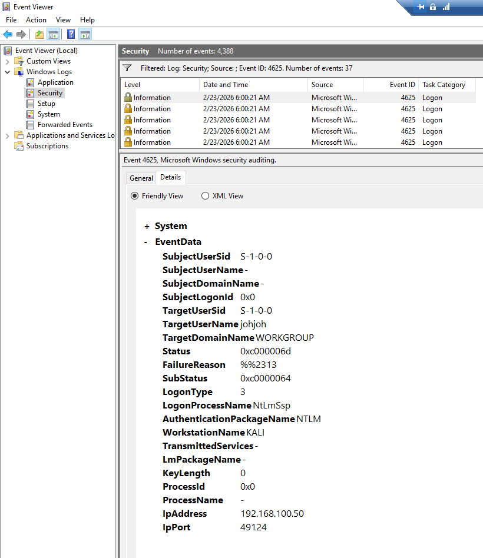
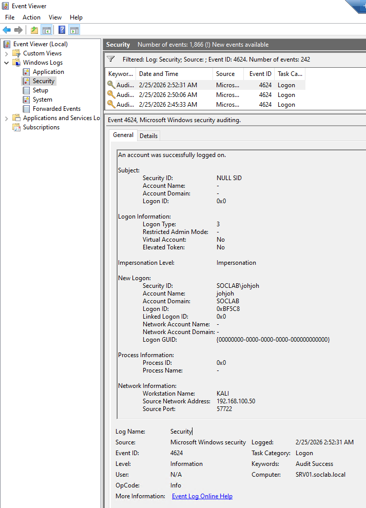

# Attack Chain Preparation - Kali Attacker Node

## Objective

Deploy a dedicated attacker machine to simulate brute force and credential-based attacks against the domain environment.

## Kali Linux Configuration

- Hostname: KALI
- IP address: 192.168.100.50
- Network: SOC-LAB-NET
- DNS server: 192.168.100.10

The attacker machine is fully isolated within the lab network and will be used to generate authentication events for detection engineering.

## Evidence

### Kali VM Created

### Kali Static IP Configuration

## RDP Exposure on WIN10

Remote Desktop Protocol (RDP) was enabled on WIN10 to simulate an exposed authentication service.

This will be used to generate failed and successful authentication events from the attacker node.

### Evidence

## SMB Brute Force Simulation - rpcclient

A brute force attack was simulated from KALI against WIN10 over SMB (port 445) using rpcclient in a loop.

Command used:

for pass in $(cat passwords.txt); do rpcclient -U johjoh%$pass 192.168.100.30 -c "exit"; done

This generated multiple failed logon events in Windows Security logs.

- Event ID: 4625
- Logon Type: 3 (Network)
- Source IP: 192.168.100.50

This behavior represents a typical password spraying attack pattern.

### Evidence

## Credential Compromise - Successful SMB Authentication

After multiple failed authentication attempts (Event ID 4625), a successful login event was generated from the attacker node.

The attacker successfully authenticated using a password contained in the password list.

- Event ID: 4624
- Logon Type: 3 (Network)
- Account Name: johjoh
- Source IP: 192.168.100.50

This represents a successful credential compromise following a brute force / password spraying attack.

The event sequence demonstrates the transition from repeated authentication failures to a valid account compromise.

### Evidence

### Detection Considerations

The sequence of multiple 4625 events followed by a 4624 from the same source IP within a short time window is a strong indicator of successful brute force activity.

This pattern should trigger alerting logic in SIEM solutions such as Microsoft Sentinel.

## Lateral Movement - SMB Authentication to SRV01

Using the compromised domain credentials, authentication was performed against SRV01 over SMB.

Command used:

rpcclient -U SOCLAB/johjoh 192.168.100.20

This generated a successful authentication event on SRV01.

- Event ID: 4624  
- Logon Type: 3 (Network)  
- Source IP: 192.168.100.50  

This demonstrates lateral movement using valid domain credentials.

### Evidence

