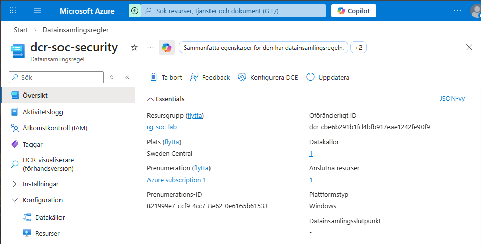

# Cloud Integration - Azure Arc and Microsoft Sentinel

## Objective

Extend the on-prem attack chain into Azure by forwarding Windows Security logs to Microsoft Sentinel.

This phase transitions the lab from standalone AD logging to hybrid cloud monitoring.

## Azure Architecture

On-Prem:
- DC01
- SRV01

Azure:
- Resource Group: rg-soc-lab
- Log Analytics Workspace: law-soc-lab
- Microsoft Sentinel enabled
- Azure Arc enabled server: SRV01

## Azure Arc Onboarding

SRV01 was onboarded to Azure Arc to allow hybrid management and monitoring.

Steps performed:
- Created Azure Arc connection script
- Installed Connected Machine Agent on SRV01
- Registered server in Azure
- Verified status: Connected

This allows Azure Monitor Agent to be installed for log forwarding.

## Current Status

- Sentinel activated
- SRV01 connected via Azure Arc
- Preparing Azure Monitor Agent installation

### Evidence

## Data Collection Rule - Windows Security Log

A custom Data Collection Rule (DCR) was created to forward Windows Security logs from SRV01 to Log Analytics.

Configuration:
- Data source: Windows Security log
- Collection type: Custom
- Target workspace: law-soc-lab
- Assigned resource: SRV01 (Azure Arc)

This enables cloud-based detection of authentication activity and credential dumping.

### Evidence

