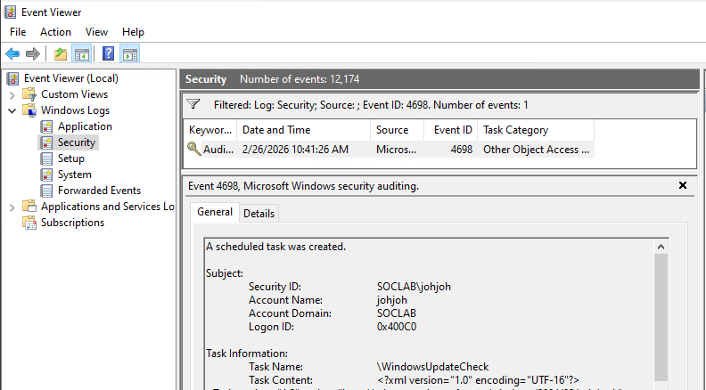

# Incident Investigation - Suspicious Scheduled Task Persistence

## Objective

The objective of this lab is to simulate an attacker persistence technique
and perform a SOC-style incident investigation using Windows Security logs.

This investigation demonstrates how suspicious scheduled tasks can be
identified and analyzed during incident response activities.

## Environment

Target System:
- SRV01

Domain:
- SOC.local

User Account:
- SOC\johjoh

Log Source:
- Windows Security Event Logs

## Environment Validation

Initial validation of the system and user context was performed before
starting the incident simulation.

## Evidence

System and user context verification.

## Attack Simulation

A scheduled task was created to simulate attacker persistence on the system.

Command executed:  
schtasks /create /sc minute /mo 5 /tn WindowsUpdateCheck /tr "powershell.exe -nop -w hidden -c whoami"

This scheduled task executes PowerShell with suspicious parameters commonly associated with attacker persistence techniques.

## Evidence

Scheduled task successfully created on SRV01.

## Task Verification

The scheduled task was verified to confirm persistence was successfully
established on the system.

Command used:  
schtasks /query | findstr Update

## Evidence

Verification confirmed that the scheduled task WindowsUpdateCheck
exists on the system and is configured for execution.

## Incident Investigation

The investigation phase began by reviewing Windows Security logs
to identify suspicious persistence activity.

### Step 1 - Scheduled Task Creation Detection

Event ID 4698 revealed the creation of a new scheduled task
on the system.

Key observations:

- Task Name: WindowsUpdateCheck
- Creator Account: SOC\johjoh
- Persistence mechanism identified

## Evidence

Security logs confirmed scheduled task creation activity.

