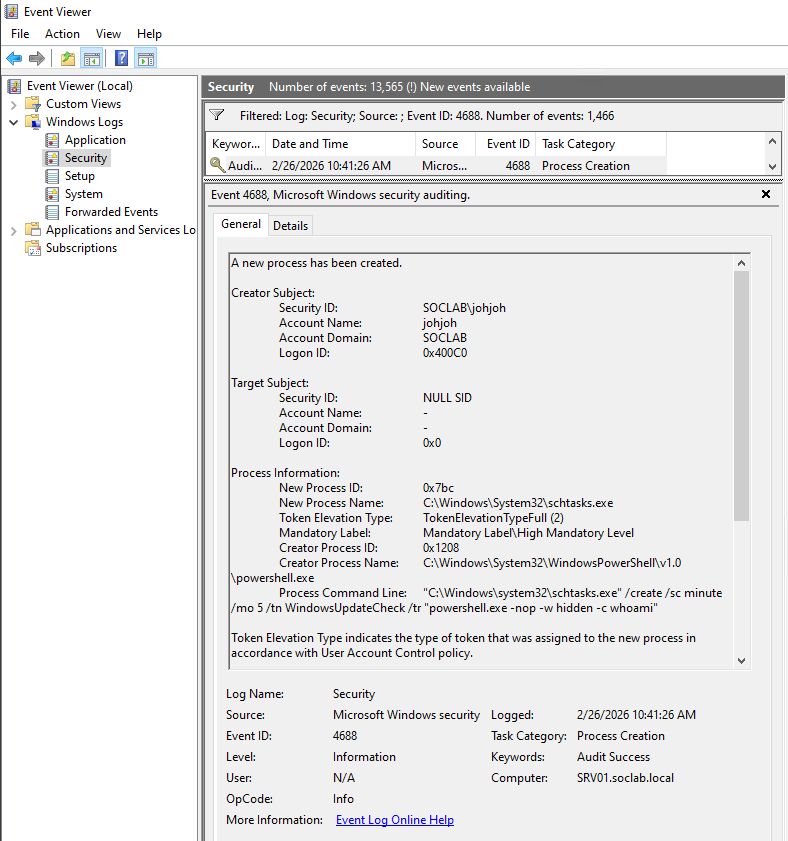

# Incident Investigation - Suspicious Scheduled Task Persistence

## Objective

The objective of this lab is to simulate an attacker persistence technique
and perform a SOC-style incident investigation using Windows Security logs.

This investigation demonstrates how suspicious scheduled tasks can be
identified and analyzed during incident response activities.

## Environment

Target System:
- SRV01

Domain:
- SOC.local

User Account:
- SOC\johjoh

Log Source:
- Windows Security Event Logs

## Environment Validation

Initial validation of the system and user context was performed before
starting the incident simulation.

## Evidence

System and user context verification.

## Attack Simulation

A scheduled task was created to simulate attacker persistence on the system.

Command executed:  
schtasks /create /sc minute /mo 5 /tn WindowsUpdateCheck /tr "powershell.exe -nop -w hidden -c whoami"

This scheduled task executes PowerShell with suspicious parameters commonly associated with attacker persistence techniques.

## Evidence

Scheduled task successfully created on SRV01.

## Task Verification

The scheduled task was verified to confirm persistence was successfully
established on the system.

Command used:  
schtasks /query | findstr Update

## Evidence

Verification confirmed that the scheduled task WindowsUpdateCheck
exists on the system and is configured for execution.

## Incident Investigation

The investigation phase began by reviewing Windows Security logs
to identify suspicious persistence activity.

### Step 1 - Scheduled Task Creation Detection

Event ID 4698 revealed the creation of a new scheduled task
on the system.

Key observations:

- Task Name: WindowsUpdateCheck
- Creator Account: SOC\johjoh
- Persistence mechanism identified

## Evidence

Security logs confirmed scheduled task creation activity.

### Step 2 - Suspicious Process Execution

Event ID 4688 confirmed execution of PowerShell initiated on the system.

Indicators observed:

- powershell.exe execution
- Hidden execution parameters
- No profile usage (-nop)

## Evidence

Process creation logs confirmed suspicious PowerShell execution
associated with the scheduled task activity.

### Step 3 - User Authentication Validation

Authentication logs were reviewed to validate the user context
responsible for the observed activity.

Event ID 4624 confirmed successful user logon associated with
the scheduled task creation and execution events.

## Evidence

Security logs confirmed authenticated user activity prior to
persistence establishment.

## Attack Timeline

| Time | Activity |
|------|-----------|
| User Logon | Successful authentication detected (Event ID 4624) |
| Task Creation | Scheduled task WindowsUpdateCheck created (Event ID 4698) |
| Process Execution | schtasks.exe executed with embedded PowerShell command (Event ID 4688) |

## MITRE ATT&CK Mapping

T1053.005 – Scheduled Task (Persistence)  
T1059.001 – PowerShell (Execution)

## Detection Considerations

Security monitoring solutions should generate alerts when
new scheduled tasks are created unexpectedly on systems.

Execution of schtasks.exe containing embedded PowerShell
commands represents a strong indicator of persistence activity.

Correlation between scheduled task creation and suspicious
process execution significantly improves detection capability.

## Analyst Conclusion

The investigation identified a scheduled task configured to
execute PowerShell using hidden execution parameters.

Analysis of Windows Security logs confirmed persistence
activity associated with authenticated user actions on SRV01.

The observed behavior aligns with common attacker techniques
used to maintain system access after initial compromise.

In a production SOC environment, this activity would require
further host investigation and credential validation.

## Lab Completion

The investigation phase concludes the simulated attack lifecycle,
demonstrating detection and analysis across a hybrid SOC environment.

[Back to Portfolio Overview](../)
